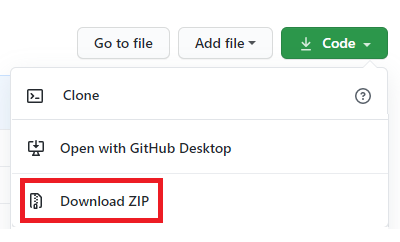
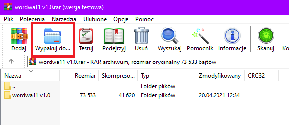
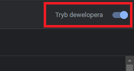
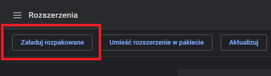
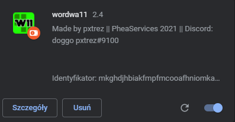

# Wordwa11

Wordwa11 is a cheat for wordwall.

## Installation

1. Download cheat as zip file.    
  
2. Unpack zip file.    
  
3. Go to [chrome://extensions](chrome://extensions) and turn on developer mode.    
  
4. Click 'Load unpacked' and select wordwa11 cheat folder.    
  
5. Check if extension loads correctly.    
  

## Usage

1. Open your wordwall link.
2. Click on wordwa11 extension logo.
3. Make sure you have a wordwall account and you are logged into it in your browser.
4. Click 'Inject cheat' and have fun!

Works on private wordwalls, but only in "play" aka test mode. (that's weird)
# Any problems? Contact me: `doggo pxtrez#9100`

## License
[GNU GPL v.3.0](https://choosealicense.com/licenses/gpl-3.0/)
