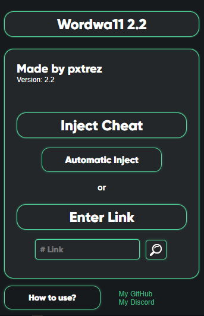

# Wordwa11

Wordwa11 is a cheat for wordwall.    
* [Usage](#Usage "Goto Usage")  
* [Installation](#Installation "Goto Installation")  
* [Bugs](#Known-bugs "Goto Known-bugs")  
* [Suggestions](#Any-suggestions "Goto Any-suggestions")  
<!--* [License](#License "Goto License")   -->

## Usage

1. Open your wordwall test.
2. Click on wordwa11 extension logo.
3. Make sure you have a wordwall account and are logged into it in your browser.
4. Click 'Automatic Inject' or paste link in '# Link' input. Then wait few seconds and have fun!
  
  
Works on private wordwalls, but only in "play" aka test mode. (that's weird)

## Installation

1. Download cheat as zip file.    
  
2. Unpack zip file.    
  
3. Go to [chrome://extensions](chrome://extensions) and turn on developer mode.    
  
4. Click 'Load unpacked' and select wordwa11 cheat folder.    
  
5. Check if extension loads correctly.    
  

## Known bugs
none

## Any suggestions?
Contact me: `doggo pxtrez#9100` or create an issue
<!--## License
[MIT](https://choosealicense.com/licenses/mit/)
